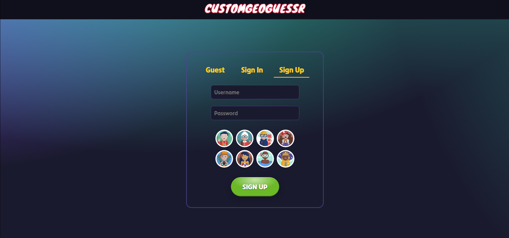
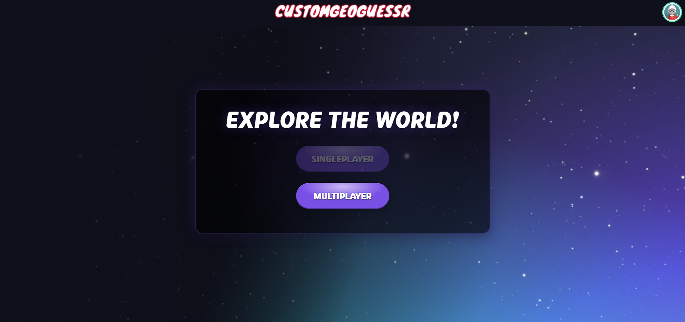
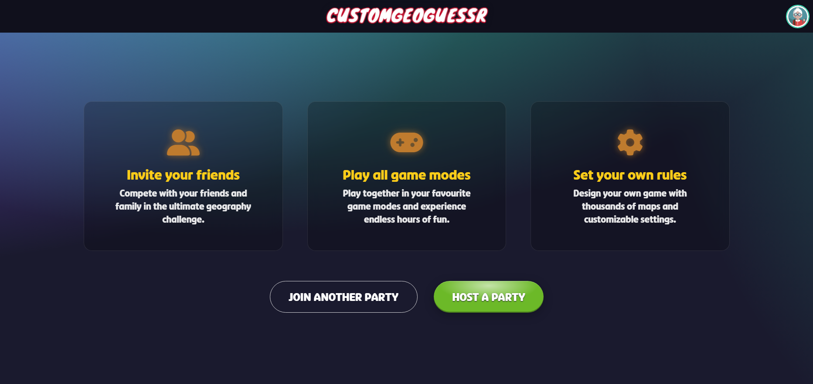
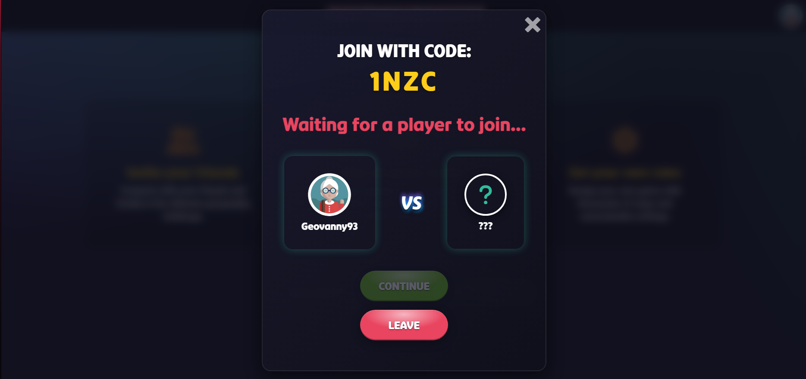
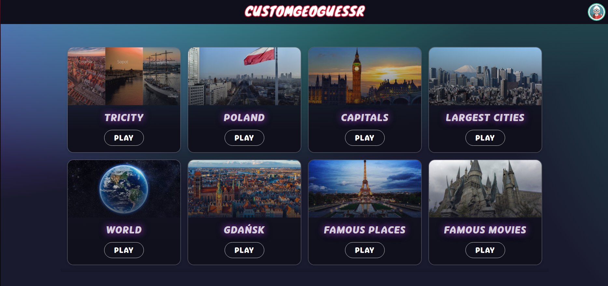
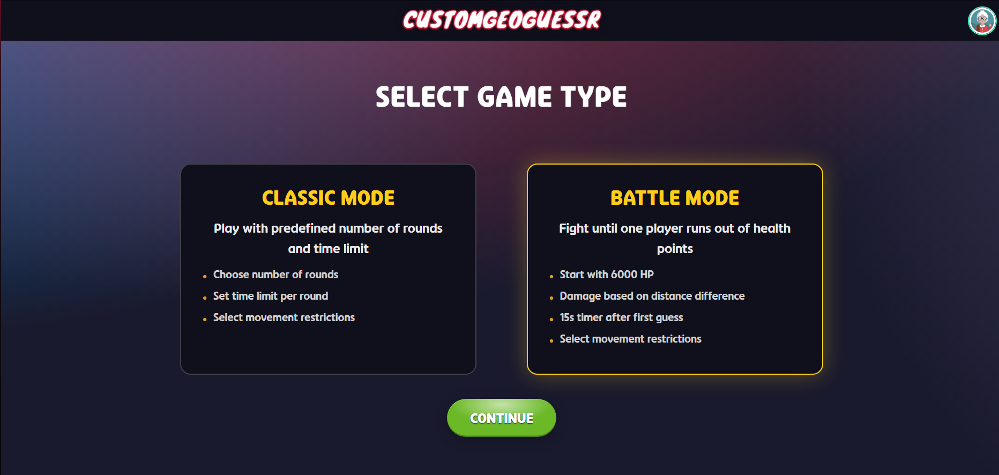
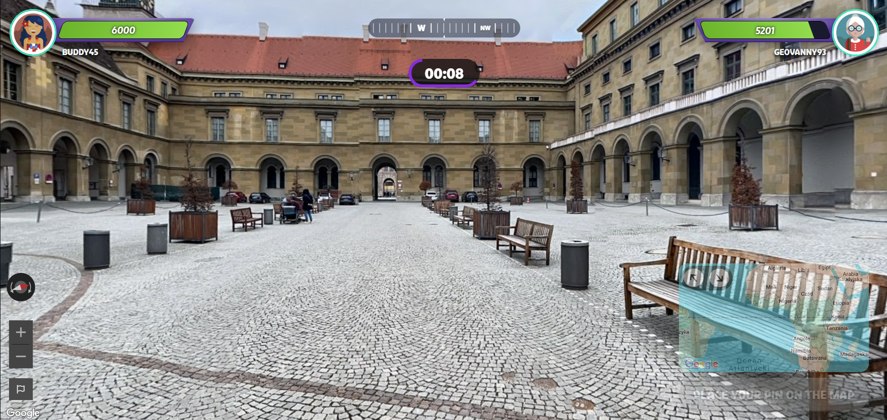
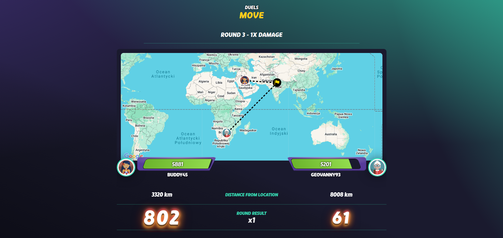
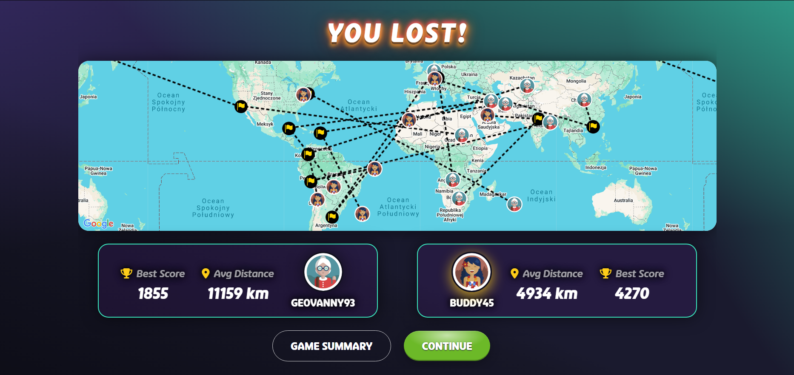
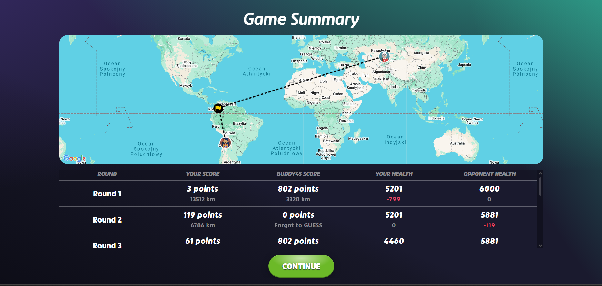

# CustomGeoGuessr

A custom implementation of the geography game GeoGuessr, where players guess locations based on Street View.

## Table of Contents

- [About The Project](#about-the-project)
- [Features](#features)
- [Technologies Used](#technologies-used)
- [Screenshots](#screenshots)

## About The Project

CustomGeoGuessr is an interactive web application that challenges users to guess geographic locations based on Street View. Players can create custom games and compete with friends in real-time multiplayer sessions.

### Features

- **Custom Game Creation**: Create personalized games with specific maps and rules
- **Multiplayer Mode**: Play with friends in real-time multiplayer sessions
- **User Authentication**: Secure login with email or play anonymously as guest
- **Customizable Settings**: Adjust game parameters to suit your preferences
- **Advanced Scoring System**: Earn points based on accuracy and speed
- **Game Analytics**: Track player performance and game statistics
- **Responsive Design**: Play on desktop or mobile devices

## Technologies Used

- **Frontend**: React, Redux, SCSS
- **Backend**: Firebase Authentication, Firebase Realtime Database
- **APIs**: Google Maps API, Street View API
- **Development**: Webpack, Babel, ESLint

## Screenshots

### Interface

| Sign-up                             | Game Mode                               |
| ----------------------------------- | --------------------------------------- |
|  |  |

### Multiplayer

| Party                                 | Host                          |
| ------------------------------------- | ----------------------------- |
|  |  |

### Game Settings

| Map                         | Type                               |
| --------------------------- | ---------------------------------- |
|  |  |

### Game interface

| Gameplay                         | Round result                                  |
| -------------------------------- | --------------------------------------------- |
|  |  |

### Post-Game interface

| Game result                                 | Game summary                                  |
| ------------------------------------------- | --------------------------------------------- |
|  |  |
